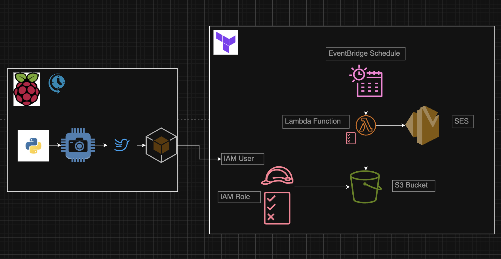

# raspberry-pi-birds



### Package Requirements
1. AWS CLI
2. Terraform
3. Python3
4. Raspberry Pi (this is for Trixie on v13)
5. Raspberry Pi Camera

### Execution
1. Clone this repo down
   ```bash
   git clone https://github.com/esalohs/raspberry-pi-birds.git
   cd raspberry-pi-birds
   ```
3. Create a named AWS Profile in `~/.aws/credentials`
4. Update terraform.tfvars with:
   ```bash
   cd iac
   vi terraform.tfvars
   ```
5. Run the following to create:
   - S3 bucket
   - AWS IAM User and Access Keys --> these will be used by the python script to upload objects to S3
   - Lambda Function
   - AWS SES
   - EventBridge
   ```bash
   terraform plan
   terraform apply
   bash ./postDeployment.sh
   ```
6. CD into `python-code` and update any variables in `main.py`
7. Run
   ```bash
   python3 -m venv --system-site-packages venv
   source venv/bin/activate
   pip install opencv-python ultralytics boto3
   python ./main.py
   ```
8. To schedule the job to run, for example, every day at 8 am, run
   ```
   crontab -e
   # add this line
   0 8 * * * /home/${piUserName}/Documents/${pathToCode}/venv/bin/python /home/${piUserName}/${pathToCode}/python-code/main.py >> /home/${piUserName}/${pathToCode}/bird_detection.log 2>&1
   ```
   

  
